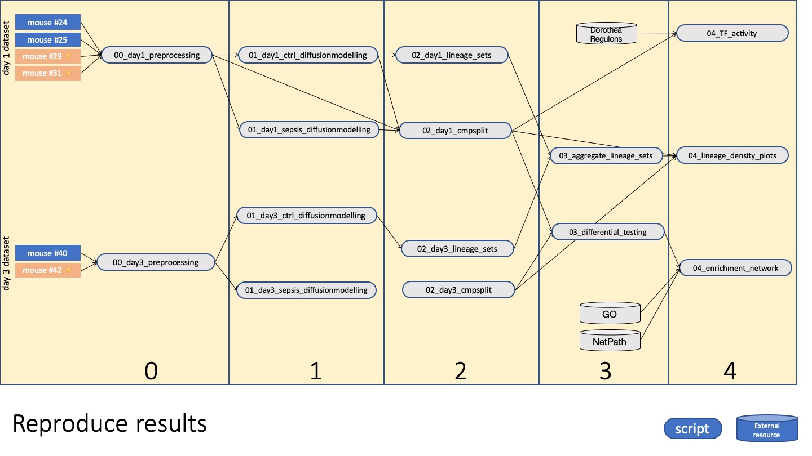

The analysis performed is structured as follows (arrows indicate dependencies)

The matching R environment is stored in `renv.lock` and can be restored using the `renv` package.

Data will be made available during the review process
